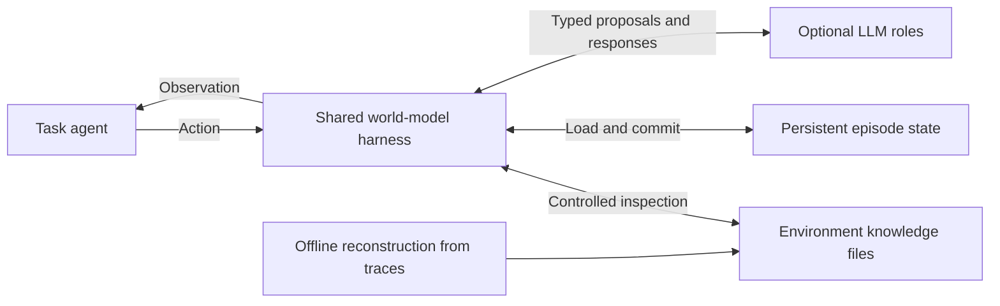
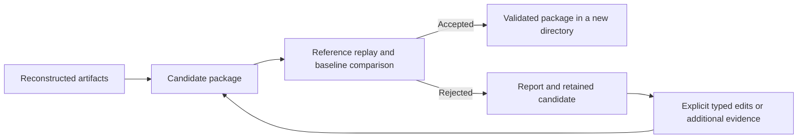

# Architecture: environment workspace and agentic harness

[README](../README.md) introduces the agentic language world model. This guide is the project
map: what is reconstructed, what the shared harness does, and how files become behavior.

## The world model plays the environment

There are two roles in the interaction. A **task agent** chooses an action, such as a tool call,
to advance its task. Trace2Env's **world-model agent** receives that action and produces the
environment's response. It uses an explicit workspace to maintain a coherent world across turns.

Conceptually, one step is `Harness(model, package, session_state, action) → observation, next_state`.
The package describes the environment; session state describes this particular episode. The
harness decides how to inspect knowledge, construct a plan, check it, and persist the result.
An audit exposes the mechanism behind the observation.



The world-model agent operates the workspace through tools: it inspects reconstructed knowledge,
searches it, reads the session state, recalls what the episode has already shown, dry-runs rules,
and submits a typed transition with citations. A confident, templated rule may short-circuit the
agent (the fast path). Both routes share state, verification, and commit semantics. The agent,
an optional verifier, and an optional renderer are logical roles; they do not require separate
autonomous agents or separate model weights. [Runtime harness](RUNTIME_HARNESS.md) contrasts
this with prompted simulation.

## What is reconstructed and what is designed

| Object | Contains | Lifecycle |
|---|---|---|
| Environment package | Reconstructed action/state schemas, rules, invariants, renderers, demonstrations, evidence | Immutable environment knowledge; may serve many sessions |
| Session workspace | One episode's current state, pending events, revision, audit history | Initialized from supplied state; evolves under the harness |
| Construction work directory | Raw archives, normalized events, local evidence, proposals, review outputs | Intermediate files for one offline build |
| Shared harness | Inspection APIs, control loop, executor, verifier, renderer integration, persistence | Designed Python implementation reused across environments |

For example, `world.balance` being numeric belongs to the package schema. An account currently
having `80.0` belongs to the session. A recorded withdrawal that supports a rule belongs to the
construction evidence. A renderer describes how that transition becomes an observation string.

**Environment agent workspace** means the package plus one active session. The implementation
accepts separate `package_dir` and `session_dir` paths; it does not require one physical folder.
The harness operates on the package through typed inspection and on the session through state
transactions. Offline reconstruction generates environment data files, not a new harness program.

## Constructed environment files and their consumers

[`EnvironmentCompiler.compile`](../src/trace2env/compiler.py) writes the package. Model stages
produce typed knowledge, deterministic selection chooses examples, and the compiler creates
the storage/index/manifest files. This is the connection between offline learning and online use.

### Files that define runtime behavior

| Package path | Produced from | Contents | Actual runtime consumer |
|---|---|---|---|
| `action_schema.json` | Interface induction | Canonical actions, aliases, argument types/requirements | `EnvironmentPackage` loads it; `PackageInspector` exposes it; runtime canonicalizes and validates actions |
| `state_schema.json` | Interface induction | State paths, types, mutability, descriptions, optional defaults | Schema inspection and mutation/type checks; authored sessions may initialize from declared defaults |
| `rules/index.jsonl` | Reviewed rules filtered by eligibility | Conditions, ordered effects, outcomes, priority, scope, provenance, renderer links/templates | Loaded into `package.rules`; used by action inspection, full-set rule selection, deterministic planning, and support verification |
| `invariants.json` | Rule induction/review | Conditions that must hold on candidate state | Loaded globally; returned in action inspection and checked by `_verify` on every step |
| `renderer/contracts.json` | Observation-contract induction | Action associations, content type, required fields, templates, instructions, examples | Required-field checks and response rendering; descriptive instructions enter optional model context |
| `demonstrations/transitions.jsonl` | Evidence selection | Example actions/observations, known state projections, outcome and rule/source links | Action inspection supplies examples to the agent's brief and tools; also available to the optional renderer |
| `knowledge/notes.jsonl` | Note induction | Conventions, formats, constraints, facts, and concepts that are not rules, with kind, action types, confidence, status, provenance | Supported notes enter action inspection and full-text search; the agent cites them (`note:<id>`) |
| `manifest.json` | Compiler metadata and file hashing | Environment identity, scope, confidence threshold, validation status, artifact/config digests, file hashes | Package loading/integrity checks, runtime startup gate, rule eligibility, package summaries |
| `index.sqlite` | Compiler-built catalog | Rule/demonstration/state-field tables plus a `knowledge` catalog (rules, notes, demonstrations, evidence, actions) with an FTS5 index when SQLite supports it | `search` (rules) and the agent's `search_knowledge` tool; direct action inspection uses loaded JSON artifacts |

`EnvironmentPackage` loads the schemas, executable rules, invariants, renderers, and
demonstrations into memory at startup. The LLM receives selected structured views and current
state, rather than the full directory. Generic role instructions come from the repository's
[prompts.py](../src/trace2env/prompts.py). Per-environment templates and renderer instructions
come from the constructed artifacts.

### Files for navigation, evidence, validation, and repair

| Package path | Produced from / meaning | How it is used |
|---|---|---|
| `overview.md` | Compiler-generated environment description and counts | Human orientation; current runtime summaries are built from the manifest and loaded objects, not this Markdown file |
| `rules/by_action/*.jsonl` | Executable rules grouped into action shards | Inspectable exports and paths referenced by the catalog; the current action inspector reads `rules/index.jsonl` through memory, not these shards |
| `candidates/rules.jsonl` | Complete reviewed rule set, including withheld rules | Audit and future revision; tentative/conflicted candidates do not become executable merely by being stored here |
| `exceptions/unresolved.json` | Unresolved questions from induction/review | Human diagnosis and future construction; the runtime summary exposes a count, not this complete text |
| `evidence/sources.json` | Original UTF-8 snapshots keyed by content digest | Source audit and provenance validation |
| `evidence/episodes.jsonl` | Normalized episodes with qualified event IDs and metadata | Inspect event content, order, scope, and source identity |
| `evidence/transitions.jsonl` | Aligned action/result slices | Inspect supporting history, output alignment, ambiguity, and concurrency |
| `evidence/local_transitions.jsonl` | Extracted local transition claims and recorded observations | Trace a general rule back to local evidence |
| `construction/artifacts.json` | Full typed reconstruction snapshot, including sources and split assignments | Replay loads source/group metadata and fingerprints; typed repair edits this canonical artifact set |
| `construction/config.json` | Build configuration | Reproducible recompilation, scope and configuration fingerprint checks during replay/promotion |
| `validation/replay.json` | Passing report included when promoting a version | Audit of acceptance; startup uses the validation status in the manifest |

These records preserve how the environment was recovered. They are not automatic per-step
prompt inputs, and the current planner has no raw-evidence inspection tool. Integrity checking
still reads manifest-listed files to verify hashes; this is separate from using their contents
to plan a transition.

### Session files created by the harness

| Session path | Owner | Purpose |
|---|---|---|
| `session.sqlite` | `SessionStore`, `EpisodicMemory` | Authoritative current state, revision, pending events inside state, audit history, and the episode's memory (`memory` table with an FTS5 index when available) |
| `state.json` | Refreshed by `SessionStore` | Human-readable mirror of current state |
| `audit.jsonl` | Refreshed by `SessionStore` | Human-readable records of routes, tool calls, plans, retrieved IDs, citations, verification, observations, and failures |

These are runtime outputs, not inferred offline environment constants. Reconstructed sessions
require explicit initial state. Subsequent actions reuse the committed state; a new session can
reuse the same environment package with different initial conditions.

## The shared agent harness

| Designed component | Responsibility | Knowledge/state it uses |
|---|---|---|
| [package.py](../src/trace2env/package.py) | Load/check the package and expose controlled inspections and full-text knowledge search | Manifest, action/state schemas, rules, invariants, renderers, examples, notes, knowledge catalog |
| [runtime.py](../src/trace2env/runtime.py) | Orchestrate one action: fast path or agent route, verification under a trust policy, rendering, commit, memory | Current state, request and caller context, retrieved artifacts, typed submission |
| [workspace.py](../src/trace2env/workspace.py) | The agent's tools over knowledge, state, and memory, with bounded results and retrieval registration | Package, working state, episodic memory |
| [agent.py](../src/trace2env/agent.py) | The tool-calling loop with a budget, forced submission, and a trace | Tool catalog, brief, model replies |
| [memory.py](../src/trace2env/memory.py) | Episodic memory of observed and simulated turns, searchable and pageable by turn | Session database |
| [transcript.py](../src/trace2env/transcript.py) | Deterministic terminal transcript helpers: prompt-line parsing and the most frequent prompt signature, the pending-work hint for waits and key presses, the opt-in command skeleton | Recorded observations, the action |
| [trace_corpus.py](../src/trace2env/trace_corpus.py) | FTS index over the raw action -> observation turns of construction traces (`search_traces`, `read_trace_turn`): the retrieval control that replaces reconstructed knowledge in the `agentic_raw_traces` experiment | Trace files, deterministic segmentation |
| [engine.py](../src/trace2env/engine.py) | Evaluate conditions, resolve/apply effects, render templates, process due events, check invariants/support | Executable rules, candidate state, action arguments |
| [state_tracking.py](../src/trace2env/state_tracking.py) | Reconstruct session state and memory from an observed interaction prefix before the first prediction | Rules and templates for observed turns, state schema for checking model-proposed mutations |
| [validation.py](../src/trace2env/validation.py), [eligibility.py](../src/trace2env/eligibility.py) | Enforce artifact, mutation, status, and scope constraints | Schemas, provenance, manifest policy, current state |
| [session.py](../src/trace2env/session.py) | Own persistent state and commit/rollback boundary | Session database, revision, audit record |
| [llm.py](../src/trace2env/llm.py), [prompts.py](../src/trace2env/prompts.py) | Supply model transport and generic role contracts | Structured request/state/retrieval payloads; no unrestricted workspace access |

The full online process and inspection-to-file mapping are in [Runtime harness](RUNTIME_HARNESS.md).
The rest of this guide explains how the environment knowledge used by these components is built.

Environment rules are data interpreted through the engine's supported condition/effect
primitives. A new environment supplies different knowledge and initial state; a new execution
primitive requires a harness change. Simulated terminal/tool actions update represented state
and observations rather than invoking the original environment's commands.

## Offline construction

Entry point: [`TraceReconstructor.run`](../src/trace2env/reconstruction.py). The CLI's
`reconstruct` command invokes this pipeline and returns a candidate package directory.

| Stage | Transformation | Model call? | Owner |
|---|---|---|---|
| Ingest | UTF-8 trace files → source hashes, qualified episodes/events, declared groups/scope | Only when event-role annotations are needed | [adapters.py](../src/trace2env/adapters.py), [reconstruction.py](../src/trace2env/reconstruction.py) |
| Align | Episode events → action/result slices, bounded history, delayed/concurrent links | No | `segment_transitions` in adapters |
| Extract | One slice (events shown once, history clipped) → local action, outcome, facts, candidate mutations, provenance, ambiguity; out-of-slice citations dropped and recorded; a provider refusal or an unrepairable invalid answer becomes a zero-confidence record | Yes (slices may run concurrently, `workers`) | `extract_evidence` |
| Induce interface | Local evidence → canonical actions/aliases and state fields with path aliases; colliding aliases (an alias that names another action/field, one claimed by two entries) are dropped and reported; every observed argument name is declared afterwards; evidence is rewritten to the canonical names | Yes | `induce_schema`, `repair_schema_aliases`, `declare_observed_arguments`, `canonical_evidence` |
| Induce behavior | Evidence + matched contrasts + schema → rules and invariants | Yes | `induce_rules`, [contrasts.py](../src/trace2env/contrasts.py) |
| Review | Proposed rules + relevant evidence → revised rules, counterexamples, unresolved cases | Yes | `induce_rules` falsification pass |
| Induce rendering | Observed outputs + rules → observation contracts | Yes | `induce_renderers` |
| Induce notes | Observed transitions + rules + contracts → conventions, formats, constraints, facts that rules do not express | Yes | `induce_notes` |
| Select examples | Evidence → outcome-diverse demonstrations with observed state/rule links | No | `select_demonstrations` |
| Validate and compile | Complete artifacts → fresh candidate package | No | [validation.py](../src/trace2env/validation.py), [compiler.py](../src/trace2env/compiler.py) |

Deterministic `ingest` is a lighter parser preview: it writes episodes and transition slices.
The `reconstruct` path additionally archives raw sources, enforces declared splits, deduplicates
episodes, and can request exact-span annotations. Neither treats source text as executable code.

### What is evidence, and what is a hypothesis?

The shared contracts are in [models.py](../src/trace2env/models.py):

- `RawEvent`, `Episode`, and `TransitionSlice` identify recorded material and its alignment.
- `SourceRef` links a claim to source, episode, and event IDs. `Fact` distinguishes observed,
  inferred, and other epistemic statuses. Membership checks do not prove that a fact is true.
- `LocalTransitionEvidence` describes one recorded transition. Its observation text is reset
  from source events after extraction so a model cannot replace the recorded output.
- `TransitionRule` generalizes behavior into conditions, effects, outcome, scope, confidence,
  provenance, and renderer. It is a hypothesis subject to review and replay.
- `ReconstructionArtifacts` gathers the construction result; `ReplayCase` supplies an external
  reference; `ReplayReport` records case results and promotion eligibility.

Matched contrasts share action, exact arguments, and declared scope, and use different declared
trajectory groups. They record observed differences; they do not control hidden state. Ambiguous
or concurrent slices cannot be the sole observed support for a supported reconstructed rule.

### Budget and provider boundary

[BoundedInduction](../src/trace2env/induction.py) batches and recursively consolidates model
inputs under both a record count and a byte budget. The budget includes system text, JSON input,
and response schema. An indivisible oversized input raises an error. Induction calls remain
sequential; evidence extraction may run concurrently (`TraceReconstructor(workers=N)`). Stages
see bounded views of the material: the extractor gets each event once with history clipped
(`extraction_history_chars`, `extraction_event_chars`), the induction stages get evidence with
long values and observation text clipped (`induction_value_chars`, `induction_observation_chars`);
the recorded evidence keeps full contents.

[StructuredLLM](../src/trace2env/llm.py) isolates model transport. `CachedLLM` reuses matching
calls; `TracingLLM` logs every call (prompt, payload, output, usage, repaired attempts) for audit;
chat adapters retry transient gateway failures and raise `ProviderRefusal` on content-policy
refusals; `ScriptedLLM` provides deterministic test responses. See
[Prompt contracts](PROMPT_SKETCHES.md) for role/schema mappings. Model-generated confidence is
not calibrated empirical accuracy.

## Rule eligibility and package lifecycle

These are two independent decisions:

| Decision | Current behavior |
|---|---|
| May a rule execute? | `supported` status, sufficient confidence, matching scope, and applicable conditions |
| May a reconstructed package run normally? | It must have passed promotion; candidates require explicit diagnostic opt-in |

The full reviewed rule list is saved in `candidates/rules.jsonl`. The executable view is in
`rules/index.jsonl`; state-dependent scope is checked again at runtime. Shared eligibility
logic lives in [eligibility.py](../src/trace2env/eligibility.py).



Promotion requires passing supplied cases, at least one independent validation trajectory,
no validation/construction overlap or test-case use, executable-rule coverage, no baseline
pass-to-fail regressions, and matching artifact/configuration fingerprints. The caller supplies
reference data and trajectory-family labels. See [Offline validation](OFFLINE_VALIDATION.md)
for the authoritative format and gate details.

`PackagePatch` edits named artifacts against a base digest. The CLI compiles the changed
artifacts, replays them against the previous package, and optionally promotes a new version.
The current implementation does not generate its own repair proposals. An `authored` package,
such as the ledger demo, is explicitly constructed code and can run without the reconstruction
gate; replaying that demo does not establish learned behavior.

## Runtime and state

Entry point: [`RuntimeHarness.step`](../src/trace2env/runtime.py).

1. Load committed state and revision; apply due events to a copy.
2. Retrieve the action interface and relevant knowledge; canonicalize and validate the action.
3. Check all eligible rules so bounded retrieval cannot hide an applicable branch or conflict.
4. Build a deterministic plan, or use the optional planner when no rule applies. Incompatible
   top-priority rules raise an error.
5. Validate/apply effects on the copy, verify support and invariants, then render.
6. Commit accepted state and audit together, or record the failure while retaining prior state.

| State namespace | Intended meaning |
|---|---|
| `world` | Durable simulated environment facts: balances, files, records |
| `session` | Interaction context: login state, cwd, transaction context |
| `surface` | Visible UI or terminal state |
| `epistemic` | Explicit uncertainty or beliefs represented by the package |

The names are a modeling convention, not automatic hidden-state recovery. Initial values must
come from the episode for reconstructed sessions: supplied explicitly, or reconstructed from an
observed interaction prefix by [state tracking](RUNTIME_HARNESS.md#starting-from-an-observed-prefix).
Replay uses its supplied state directly and checks missing-state applicability conservatively.
Detailed execution and rollback semantics are in [Runtime harness](RUNTIME_HARNESS.md).

## Construction intermediates and directory layout

```text
work-dir/                         # reconstruction intermediates
  raw/{sources.json,episodes.jsonl}
  normalized/{episodes.jsonl,transitions.jsonl}
  evidence/all.jsonl
  induction/{schema.json,contrast_sets.json,rules.proposed.json,
             rules.reviewed.json,renderers.json}
  artifacts.json

package/                          # immutable shared knowledge
  manifest.json                   # scope, hashes, validation metadata
  overview.md                     # generated description for readers
  construction/{artifacts.json,config.json}
  evidence/{sources.json,episodes.jsonl,transitions.jsonl,local_transitions.jsonl}
  candidates/rules.jsonl           # includes withheld reviewed rules
  action_schema.json, state_schema.json, invariants.json
  rules/index.jsonl, rules/by_action/*.jsonl
  renderer/contracts.json, demonstrations/transitions.jsonl
  knowledge/notes.jsonl            # conventions, formats, constraints, facts
  exceptions/unresolved.json, index.sqlite
  validation/replay.json           # present after promotion

session/                          # one evolving episode
  session.sqlite                  # authoritative state, audit, and episodic memory
  state.json, audit.jsonl          # human-readable mirrors
```

The SQLite package index supports lexical (full-text) discovery and artifact lookup; it is not
a vector embedding index. Packages retain raw evidence. Keep trace data and derived packages
under the same access/retention policy as their source material.

## Evaluation boundaries

| Command | Supplied inputs | Produces | Model calls |
|---|---|---|---|
| `replay` | Package, `ReplayCase` JSONL, optional baseline | Deterministic case report; optional promotion | No |
| `awb-export` | AgentWorldBench rows | One episode JSON per trajectory plus a split manifest, for `reconstruct` | No |
| `awb-run` | AgentWorldBench rows; a package for `--mode agentic` | Prediction rows (`gen` plus `trace2env` diagnostics) in the official format | Yes, unless `--no-model` |
| `awb-judge` | Prediction rows | Official 1-5 judge scores per row | Yes |
| `awb-score` | Judged rows | Per-domain and overall report on the 0-100 scale | No |

AgentWorldBench rows are not replay cases: they carry no explicit state, so `awb-run` rebuilds it
from the trajectory prefix with `StateTracker` before predicting, and scores are produced by a
port of the official LLM judge rather than by exact comparison. Final evaluation should reserve
test trajectories from construction and repair selection; [AgentWorldBench](AGENTWORLDBENCH.md)
covers the protocol and its comparability caveat. Broader measurement goals are in
Methodology; implemented report fields are in `ReplayReport` and `agentworld.py`.
